Versi Text

Setting MySQL
1. buka xampp dan aktifkan "Apache" dan "MySQL"
2. buka browser dan buka dasbord xampp dengan cara tulis "/localhost/phpmyadmin"
3. buka impor lalu, klik Choose File dan pilih mahasiswa01.sql, lalu ok
4. setelah sudah ada tulisan mahasiswa01.sql, klik kirim

Untuk SQLnya bisa download 
[sql](https://github.com/MXSHOOT/tabel-java/blob/main/mahasiswa01.sql "sql")
untuk mengimport database

Buat project netbeans
1. klik new project, pilih application java (bebas sesuai dengan project yang dibuat) selanjutnya isi sesuai dengan yang diinginkan seperti nama project dll.
2. klik kanan terhadap folder yang dibuat, klik new dan klik JFrame
3. Drag lah tabel yang ada di Palette (posisi ada dipojok kanan biasanya) setelah itu drop tabel tersebut ke dalam Frame yang dibuat

Setting database di netbeans
1. buka netbeans dan buka project yang ingin disetting databasenya
2. buka services database (bisa dengan cara ctrl + 5)
3. klik kanan database lalu klik new connection
4. ubah lah driver menjadi mysql lalu next
5. selanjutnya ubah database sesuai dengan database yang kita sudah buat lalu finish
(ubah username, password, port,host jika kalau di xampp dibuat custom)

Setting java aplikasi terhubung ke database
1. klik kanan pada tabel, klik bind lalu elements
2. selanjutnya klik lah "Import Data to Form" di binding source
3. masukan database connection yang sudah dibuat lalu klik ok (tunggu sampai selesai)
4. custom lah selected nya dari yang di available atau urutannya (misal id dibuat posisi ke tiga maka posisi di tabel akan ke tiga)

Untuk melihat hasilnya, klik JFrame atau posisi table yang dibuat lalu tekan "shift + F6". 
menggunakan shift + f6 dikarenakan saya tidak membuat main atau aplikasi utama untuk menampilkan table, tapi jika ingin tinggal klik run perlu dibuat lagi sesuai dengan yang ingin dibuat.

Versi Gambar

Setting MySQL
1. 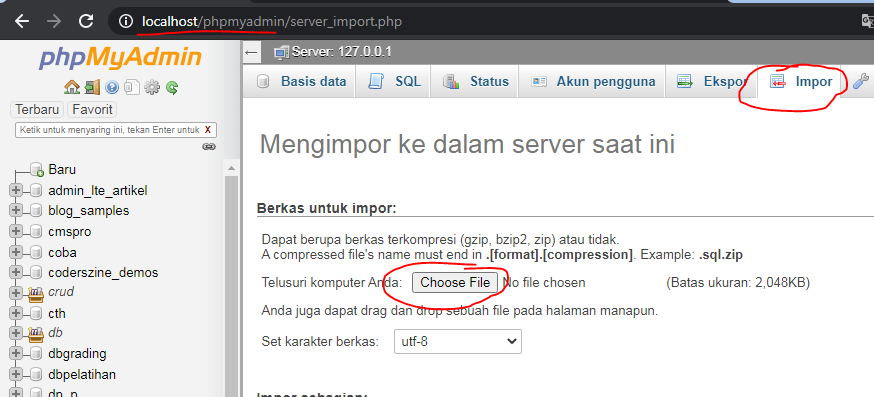
2. 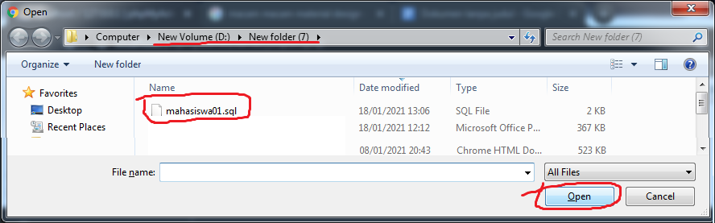
3. 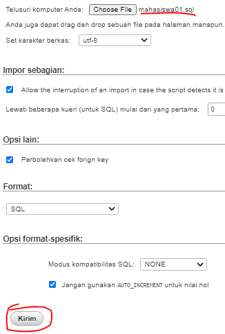

Buat project netbeans
1. 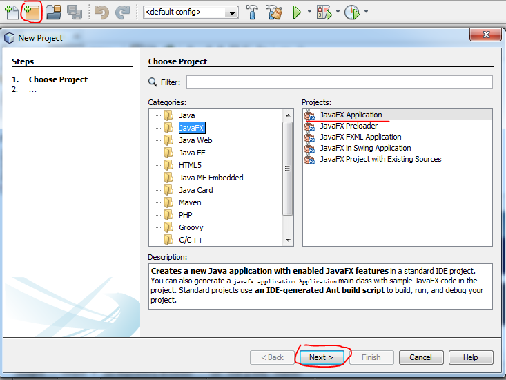
2. 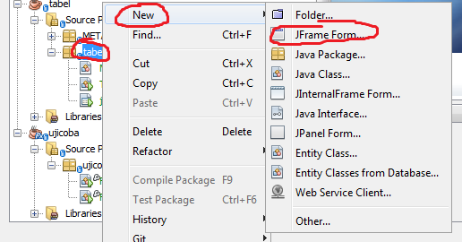
3. 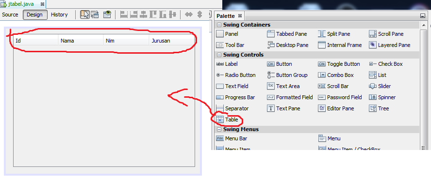

Setting database di netbeans
1. 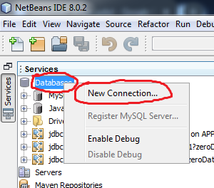
2. 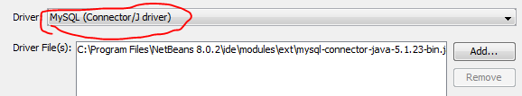
3. 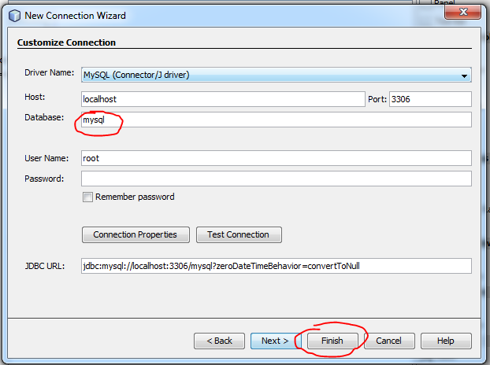

Setting java aplikasi terhubung ke database
1. 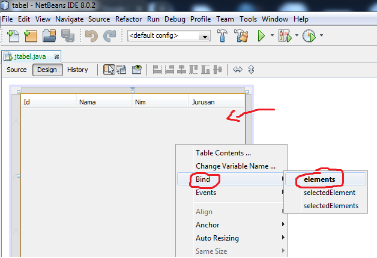
2. 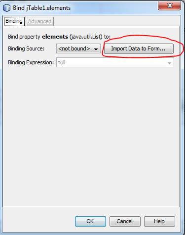
3. 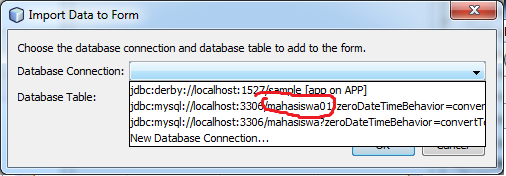
4. 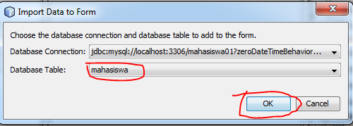
5. 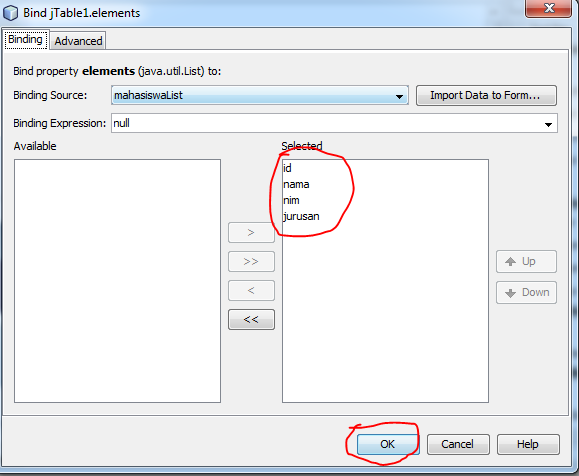
6. 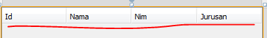
7. 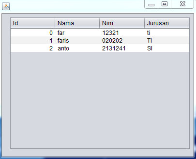
